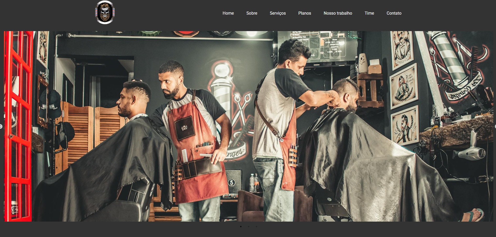

# Silva Barber Shop

<a href="https://silva-barber-shop-5avw.vercel.app/">Confira nosso site</a>

  

O site Silva Barber Shop é uma plataforma online que oferece serviços de agendamento para uma barbearia. Através dele, os clientes podem visualizar os serviços disponíveis, como cortes de cabelo e aparo de barba, e realizar reservas de forma prática e eficiente.

Projeto desenvolvido com React e suas biblioteca

Essas tecnologias combinadas proporcionam uma experiência de usuário eficiente, permitindo que os clientes agendem seus serviços de forma intuitiva e rápida.

# React + Vite

This template provides a minimal setup to get React working in Vite with HMR and some ESLint rules.

Currently, two official plugins are available:

- [@vitejs/plugin-react](https://github.com/vitejs/vite-plugin-react/blob/main/packages/plugin-react/README.md) uses [Babel](https://babeljs.io/) for Fast Refresh
- [@vitejs/plugin-react-swc](https://github.com/vitejs/vite-plugin-react-swc) uses [SWC](https://swc.rs/) for Fast Refresh
